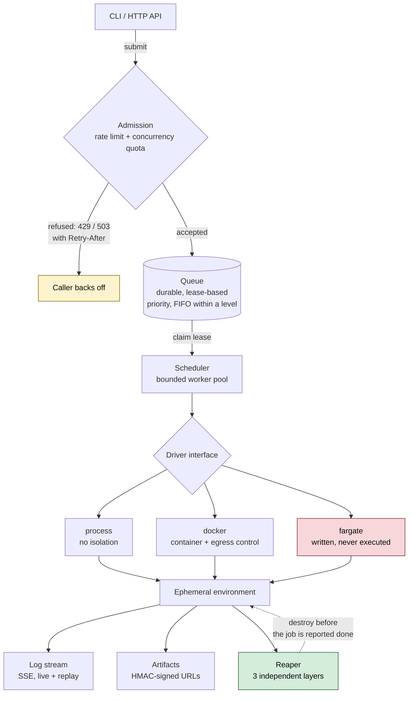
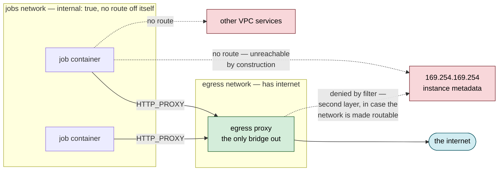
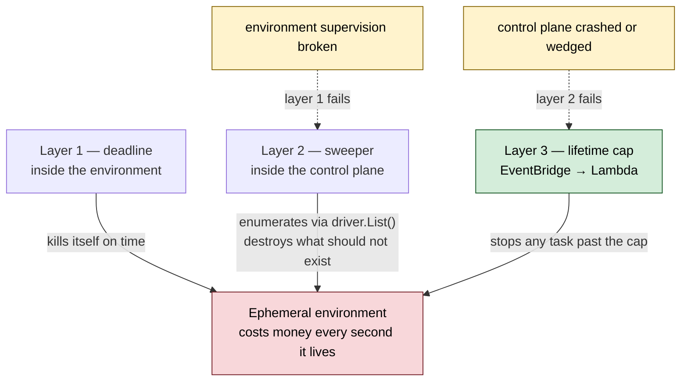
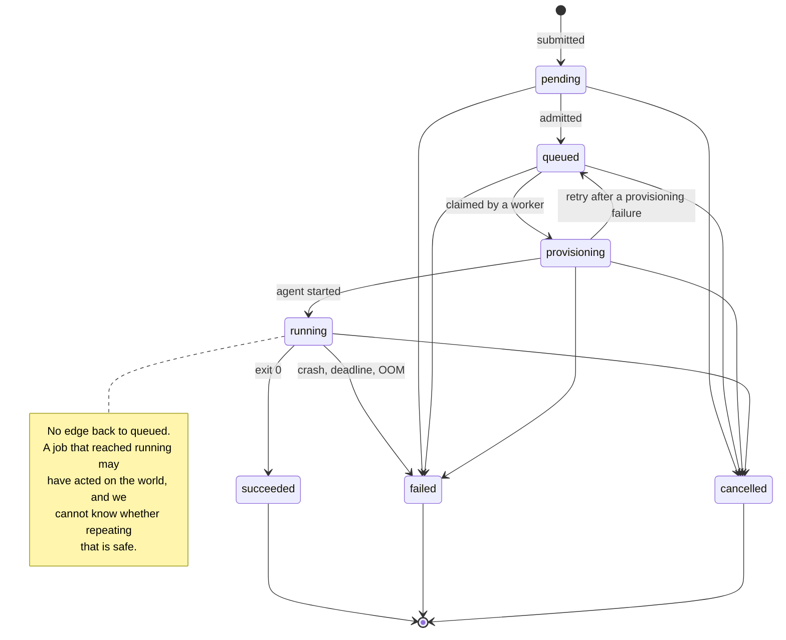

# ephemera

A control plane that runs untrusted work in disposable environments, then
proves the environment is gone.

One job, one disposable environment: provision it, run an agent inside it,
stream the output, collect the artifacts, and destroy it — with the destruction
guaranteed by three independent layers rather than by remembering to call
cleanup. The agent here is a placeholder that opens a "browser", searches and
saves a screenshot; everything wrapping it is the system.

The same core runs anything you would rather not run on your own machine:
computer-use agents, untrusted user code, CI jobs, LLM tool sandboxes.



**Fully verified locally, end to end. Designed for AWS and implemented against
it — Terraform, ECR, ECS task definitions, IAM and a `fargate` driver — but
never executed there, and labelled as such throughout.**

> **[docs/RUNBOOK.md](docs/RUNBOOK.md) is the operator's guide**: every command
> to build, run, test, deploy and tear this down, with what you should see and
> what to do when you see something else. Written to be followed without
> reading the code. Start there if you want to run it rather than read it.

---

## Run it

Nothing to install but Go. No cloud account, no daemon, no services.

```bash
make build
./bin/ephemerad --data-dir ./data &        # control plane
./bin/ephemera run --command "$PWD/bin/ephemera-agent" --query "site reliability"
```

That submits a job, streams its logs live, waits for it, and prints signed
links to the artifacts it produced:

```
submitted job_06g83mdz1ns0r2219cppsp0gg0 (priority 90)
* provisioning process environment
* agent started
  step 1/4: launching browser
  step 2/4: navigating and searching for "site reliability"
  step 3/4: waiting for results to settle
  step 4/4: capturing page state
  saved screenshot.png (1314 bytes) and result.json
* stored 2 artifact(s)

job          job_06g83mdz1ns0r2219cppsp0gg0
state        succeeded
attempts     1
duration     717ms

artifacts:
  result.json                 145 B  http://localhost:8080/v1/jobs/.../result.json?expires=...&signature=...
  screenshot.png             1.3 KB  http://localhost:8080/v1/jobs/.../screenshot.png?expires=...&signature=...
```

**With container isolation and egress control** (needs Docker):

```bash
docker compose up --build -d
ephemera run --image ephemera/agent:dev --query "distributed systems"
```

**Behaviour under load**, answered with numbers rather than an assertion:

```bash
make load-test          # 50 concurrent submissions
```

---

## What this is, and what it is not

The reusable core is a **pluggable driver interface**. Everything above it —
queueing, admission, scheduling, log streaming, artifacts, reaping — is written
once and works for any driver. Three real drivers ship:

| Driver | Isolation | Enforces limits | Enforces egress policy | Needs |
|---|---|---|---|---|
| `process` | OS process | no | no | nothing |
| `docker` | container (namespaces, cgroups) | yes | yes, structurally | a Docker daemon |
| `fargate` | microVM per task | yes | yes, via IAM | AWS |

Each driver **declares what it actually enforces**, and the control plane
**refuses to start** with a configuration its driver cannot honour. Configure an
egress deny list against the `process` driver and you get this, at boot:

```
scheduler: configuration requires network policy (mode "egress", 7 deny CIDRs)
but the "process" driver does not enforce it; use the docker or fargate driver,
or clear NetworkMode and DenyCIDRs to run without egress isolation
```

Silently dropping a security control is worse than refusing the job, because the
caller believes they have the control. That principle recurs throughout.

---

## The four hard parts

Four problems get real depth here, and they hang together only because they are
four properties of one job lifecycle rather than four separate subsystems: scheduling is what happens *between submit and dispatch*, egress is
how the environment is *created*, the flight recorder is what streams *out*, the
reaper is what guarantees it *ends*.

### 1. High-performance networking — egress control

The metadata endpoint is the whole question, and the answer differs per driver
because the truth differs per driver.

**Docker: structural, not filtered.** Job containers join an `internal: true`
network. Such a network has *no route off itself*, so `169.254.169.254` is
unreachable because *everything* is unreachable — not because a rule caught it.
An egress proxy is the only container bridging the internal network and the
internet, making it a single auditable chokepoint. Its filter denies the
metadata and RFC1918 ranges too, so the block still holds if someone later makes
that network routable.



The driver **refuses** a CIDR deny list on an ordinary bridge network, because
enforcing one needs rules in the host's `DOCKER-USER` chain that this driver
does not own and could not apply portably. That refusal names the mode that does
provide the control.

**Fargate: IAM, not network.** A security group cannot block `169.254.170.2` —
it is link-local, so it never traverses a route table, NACL or security group.
There is no network control for it. So the job task role has **no permissions at
all**, and an agent that reads its credentials from the metadata endpoint gets
credentials that can do nothing. Claiming a security group solved this would be
a wrong answer that looks right.

*Bonus (IP rotation / geo simulation):* the proxy hop exists and is the correct
insertion point — point `--egress-proxy` at a rotating pool. Not implemented.

### 2. Concurrency and scheduling

A durable, lease-based priority queue on bbolt. Dispatch order is
`[inverted priority][submitted millis][id]`, so the store's byte-order iteration
*is* the dispatch order. Within a priority level it is strictly FIFO, which is
what stops a stream of high-priority work starving an equally-prioritised job
that has waited all afternoon. A requeued job keeps its original position.

Workers **lease** rather than remove. Die, and the lease lapses and the job
returns. A worker whose lease expired while it was busy is refused when it tries
to write its result, so a takeover cannot produce two results.

Admission has **two independent controls**, because they bound different things:
a token bucket on submission *rate*, and a quota on *simultaneous execution*. A
tenant can sit well inside its rate limit and still be entitled to no more
parallelism — fifty submissions over a minute, each running an hour.

Measured, not asserted:

```
50 concurrent submissions: 50 accepted, 50 succeeded in 5s
peak observed concurrency: exactly 6 of 6 workers
environments left behind: 0
```

Concurrency is measured by sampling presence files that real agent processes
create and remove, not by trusting a counter.

With deliberately tight limits, the same 50 give 10 accepted and 40 refused,
each carrying a `Retry-After` that a test proves actually works. **Refusal is
the design working.** Accepting work the system cannot start, then dropping it,
is the failure mode this prevents.

### 3. Observability — the flight recorder

Live logs over SSE, interleaving the agent's own output with platform lifecycle
events so an operator reads one timeline rather than two. Artifacts (screenshots,
video, JSON) go to storage and are served through **HMAC-signed, expiring URLs** —
real ones, not a stub swapped for S3 later, so signing, expiry and verification
are exercised from day one.

Two rules in tension, resolved deliberately:

- **A viewer must never slow down a job.** Observability that applies
  backpressure to the thing it observes has become a liability.
- **Silently dropping output is dishonest.** An operator reading a log with an
  invisible gap draws wrong conclusions.

So a slow subscriber loses lines and is *told how many* — `[47 lines dropped:
this viewer could not keep up]`. The durable record is separate: drivers write
every line to disk, so the complete log is always recoverable, and logs replay
in full after the job ends, which is when an investigator actually arrives.

### 4. Cost control — the reaper

Three layers, each covering the previous one's failure mode:

| Layer | Where | Survives |
|---|---|---|
| 1. Deadline | inside the environment | control plane crash, network partition |
| 2. Sweeper | control plane, via `driver.List()` | worker crash, lost bookkeeping |
| 3. Lifetime cap | EventBridge → Lambda, **outside** the control plane | everything above being dead |



Each layer exists to cover the previous one's failure. Layer 3 shares no code,
no IAM role and no process with the control plane — which is the only reason it
still works when the control plane is the thing that broke.

Layer 2 enumerates what *actually exists* through the driver, never what we
remember creating — in-memory bookkeeping cannot survive the crash it needs to
recover from. Layer 3 shares no code, role or process with the thing it
backstops, because *a backstop that runs inside the thing it is backing up is
not a backstop*. It alarms on **absent** invocations, not just errors: a reaper
that silently stopped is one whose first symptom is the bill.

Every reap logs at `warn`. A system where reaps are routine has a bug it has
learned to live with.

*Bonus (Spot / warm pools):* Fargate Spot carries job capacity at weight 4
against on-demand weight 1, with `base = 1` on-demand so a Spot shortage
degrades throughput rather than stopping work. The control plane stays
on-demand — losing it mid-job stalls everything. Warm pools: not implemented.

### 5. Security and multi-tenancy (partial, claimed as such)

Not one of the four, so only what the design gives for free is claimed here.

Secrets: job specs carry **references**, never values. Values are resolved at
dispatch, held in memory for one `Start` call, and stored nowhere — not in the
queue, not in labels, not in logs. A `Secret` type refuses to reveal itself
through `fmt`, `%#v` or JSON, which is how credentials actually leak. A redactor
scrubs known values from agent output, because the *agent* may print its own
credentials even though the platform never does.

Isolation: per-job container with a read-only root filesystem, tmpfs for scratch
writes (so the job's scratch space vanishes with the container by construction),
`cap-drop ALL`, `no-new-privileges`, a non-root uid, a pids limit against fork
bombs, and always a memory limit. The artifact directory is the one deliberate
exception: it is a per-job host bind mount, because output that vanishes with
the container cannot be collected after the job — or after a crash, which is
when it is most worth having. It is removed on `Destroy` alongside the
container.

**Honestly**: containers share a kernel. This is not total memory isolation
between tenants — that needs a hypervisor boundary. Fargate provides one;
gVisor or Firecracker would too.

---

## Failure modes

The lifecycle has exactly one backwards edge, and it is the interesting part of
the design:



Failure gets a taxonomy rather than a bool, because the kind decides
**retryability** and **fault attribution**:

| Kind | Fault | Retried | Meaning |
|---|---|---|---|
| `provision_failed` | system | yes | environment never came up; agent never ran, so retry is safe |
| `start_failed` | system | yes | environment up, agent would not start |
| `agent_crashed` | user | **no** | agent ran and exited non-zero |
| `deadline_exceeded` | user | **no** | work does not fit the budget |
| `reaped_orphan` | system | no | control plane lost track; always worth alerting |
| `rejected` | user | no | bad spec, unresolvable secret, or refused at admission |
| `internal_error` | system | yes | our bug, and it should be loud |

An unclassified error defaults to **system** fault. An error nobody classified is
one nobody thought about, and it should surface as our bug rather than be quietly
blamed on the caller.

A deterministic crash retried three times is three times the cost for the same
answer, so crashes are never auto-retried. Provisioning failures are, because
nothing in the world changed.

**What happens when a VM fails to initialise:** classified `provision_failed`,
requeued keeping its original queue position, up to the attempt limit — a job
that already waited is not punished for infrastructure's fault. **When the
network is flaky:** heartbeats tolerate transient storage errors rather than
abandoning a healthy job; log streams reconnect; a lost lease stops the worker
rather than racing the one that took over.

---

## Why this stack

**Go** — single static binary into a distroless image, concurrency primitives
that make the scheduling work natural to write *and* to explain, no runtime to
install in the container.

**bbolt, not Redis or SQS** — a library, not a service. It runs with one command
and nothing else installed. ACID transactions are the one property a
job queue cannot do without. The cost is stated below.

**SSE, not WebSocket** — the traffic is one-way. Plain HTTP, no upgrade
handshake, browsers reconnect natively.

**Engine API directly, not the Docker SDK** — that SDK pulls a very large
dependency tree for a dozen stable endpoints. The cost is owning the wire
format, so stream framing and tar extraction are pure functions with their own
tests — which is exactly where the subtle bugs would otherwise hide.

---

## Scale ladder

Every limit below has a named successor. A stated limit with a successor is a
deliberate choice; the same fact unstated is a gap nobody noticed.

| Component | Now | Breaks when | Then |
|---|---|---|---|
| Queue | embedded bbolt | a **second control-plane host** — the ceiling is host count, not job rate | Redis Streams, then SQS |
| Artifacts | local filesystem | more than one host, or retention beyond local disk | S3 + lifecycle (Terraform ready) |
| Compute | Docker | host RAM — headless Chrome is 300–700 MB, so **RAM binds long before CPU** | Fargate, then Firecracker |
| Log streaming | SSE direct | multiple API instances, or replay-from-offset | pub/sub fan-out, then durable log storage |
| Scheduler | in-process pool | process death mid-job, or two schedulers racing | lease-based distributed claiming |
| Reaper | **does not move** | — | already designed for the top of the ladder |

**Honest limits at this scale:** single control-plane process, no HA. Container
isolation, not VM isolation. And *50 concurrent* is a **scheduling** claim proved
with a fast agent — no single laptop runs 50 concurrent browsers, and claiming
otherwise would not survive contact with a real workload.

---

## What has actually been verified

Overstating verification is the fastest way to make every other claim in a
README worthless. So, plainly:

| | Status |
|---|---|
| Core pipeline on the `process` driver | ✅ verified end to end, on a live daemon |
| 50 concurrent jobs, bounded concurrency, zero leaks | ✅ measured |
| Failure taxonomy, deadlines, retries, reaping | ✅ tested, including crash and hang paths |
| Secret non-leakage, signed URLs, path traversal | ✅ tested |
| HTTP API, SSE streaming, signed downloads | ✅ tested and exercised live |
| `docker` driver | ✅ integration suite executed against a live daemon — 11/11 |
| Race detector | ✅ clean — `-race` across every package, no data races |
| Terraform | ⚠️ `fmt`, `validate`, `tflint` pass; **`checkov` reports 19 findings**; **never applied** |
| `fargate` driver | ⚠️ implemented and unit tested against fakes; **never executed against AWS** |

Verified on macOS 26.5.1 (arm64), Go 1.27.0, Docker Engine 29.1.3, Terraform 1.16.1.
Reproduce any row with [docs/RUNBOOK.md](docs/RUNBOOK.md).

**No AWS account was available.** `terraform plan` needs credentials, so
"validated" means *static* validation, not a plan against a real account.
Checkov is **not** clean: 155 checks pass and 19 fail, mostly CloudWatch log
groups without KMS encryption or a one-year retention, and the reaper Lambda
without a DLQ, X-Ray, VPC placement or code-signing. Those are real findings
left open on purpose rather than silenced — the infrastructure is never applied,
and each one is a cost or complexity trade-off that deserves a decision rather
than a reflexive skip.

### What the first Docker run actually found

The Docker driver was written on a machine with no Docker daemon and the race
detector on one with no cgo. Both claims above became true only after that code
met a real daemon, and it did not survive the meeting intact. Recorded here
because a table of green ticks is worth less than what it cost to earn them:

- **Artifacts were never collectable.** `/artifacts` was a `tmpfs`, but
  collection ran `docker cp` *after* the container exited — and a tmpfs is
  unmounted on exit. Every job silently produced zero artifacts, and the failure
  was invisible because "nothing written" and "everything destroyed" look
  identical from outside. `/artifacts` is now a per-job host bind mount, which
  also means a *crashed* agent's output survives, which is when it matters most.
- **The pinned Engine API version was below the floor.** The client pinned
  `v1.43`; Docker Engine 29 rejects anything below `v1.44` with a 400 before the
  handler runs. Every integration test skipped with "daemon not available"
  against a daemon that was running — a false green, not a failure.
- **A read-only-filesystem assertion was self-satisfying.** The test matched the
  marker `WRITABLE` as a substring, which also matches `ARTIFACTS_WRITABLE`, so
  a correctly hardened container failed its own hardening test.
- **`scripts/load-test.sh` was committed non-executable** (mode 644, an artifact
  of authoring on Windows), so the 50-concurrent load test could not run at all
  — locally or in CI. It also died on macOS under `set -u`, where bash 3.2
  treats an empty array expansion as an unbound variable.

The race detector, by contrast, found nothing: the scheduler, queue, admission
controller and log broker are clean on their first real run.

### The AWS path, and exactly how far to trust it

The `fargate` driver exists, and the Terraform provisions everything it needs:
VPC and NAT, ECS cluster with Fargate Spot, task definitions, ECR repositories,
an S3 artifact bucket, scoped IAM, CloudWatch alarms and a Lambda reaper. The
runbook walks through deploying it.

It has never run. That is not a hedge, it is the single most useful thing this
section can tell you, and this project has already paid for the lesson: the
`docker` driver spent weeks in the state "written and compiles", and the first
contact with a real daemon found four bugs — one of which meant artifacts could
**never** be collected, on any job, silently. The `fargate` driver is at exactly
that maturity. My own guess at what breaks first is the CloudWatch log stream
name, an IAM gap, and an architecture mismatch on the pushed image.

What *is* demonstrable without an AWS account is the thing the abstraction was
for: the scheduler, reaper, admission control, failure taxonomy, API and CLI are
driver-agnostic. Moving from a container on a laptop to a task in a VPC touches
one package and one `switch` statement. Three drivers now pressure-test that
interface rather than two, and the third one found no reason to change it.

**Known limitations of the AWS path, even if the driver is correct:**

- **A crashed agent uploads no artifacts.** The agent tars and PUTs its own
  output to a presigned URL, so a hard kill loses it — precisely when it was
  most worth having. The fix is a sidecar that uploads on task exit.
- **The control plane's served copy of artifacts is task-local.** They are
  durable in S3, but the store the API reads from is on the task's own disk, so
  a control-plane restart loses the links. The fix is an S3-backed
  `artifact.Store`; the interface already exists.
- **Images are fixed by the task definition**, so `--image` is refused rather
  than silently ignored. Per-job images mean registering a task definition
  revision per image.
- **The queue stays embedded.** SQS is provisioned but deliberately unused:
  `queue.Queue` is a job *store* — priority claim, get, list, update — and SQS
  cannot implement it. Pretending otherwise would have been a worse lie than
  leaving it. See the scale ladder.

---

## What I would build next

1. **Run the `fargate` driver against a real account.** It is written, wired and
   unit tested; what it has never had is contact with ECS. Everything else on
   this list is speculative until that happens, because the first real run is
   where the actual next tasks get discovered — that is exactly how the four
   bugs in the `docker` driver surfaced.
2. **A sidecar that uploads artifacts on task exit**, so a crashed agent still
   yields its output. Today the agent uploads its own, which is the one case
   that cannot survive a hard kill.
3. **An S3-backed `artifact.Store`**, so artifact links survive a control-plane
   restart on Fargate. The `Store` interface is four methods and already exists;
   the work is moving URL signing out of the local implementation.
4. **Replace the embedded queue** with Redis, which is the single change that
   lifts the one-host ceiling. Note this is Redis and not SQS: `queue.Queue` is
   a job store with priority claims and arbitrary reads, and SQS provides
   neither, so the swap needs a store alongside it rather than a drop-in.
5. **Per-tenant ready queues.** Today a tenant at its concurrency quota at the
   head of the queue causes claim-and-release churn, bounded by a backoff. The
   real fix is round-robin selection across per-tenant queues so a blocked
   tenant is skipped rather than retried.
6. **Session replay**, not just logs — periodic screenshots stitched into a
   scrubbable timeline. The artifact pipeline already carries the frames.
7. **Prometheus metrics.** Structured logs and a `/v1/stats` endpoint exist;
   queue age, dispatch latency and reap counts deserve to be scrapeable.
8. **gVisor or Firecracker**, for the isolation claim the current design
   deliberately does not make.

---

## Repository map

| Path | What |
|---|---|
| `internal/job` | domain: state machine, failure taxonomy, secret redaction |
| `internal/driver` | the load-bearing interface |
| `internal/driver/process` | zero-dependency driver, real |
| `internal/driver/docker` | container driver with structural egress control |
| `internal/driver/fargate` | AWS driver: ECS tasks, CloudWatch logs, S3 artifacts — never executed |
| `internal/driver/archive` | the safe tar/directory extractor every driver shares |
| `internal/queue` | durable lease-based priority queue |
| `internal/admission` | rate limits and concurrency quotas |
| `internal/scheduler` | worker pool, retries, teardown ordering |
| `internal/reaper` | cost control, layer 2 |
| `internal/logstream` | live fan-out |
| `internal/artifact` | storage and signed URLs |
| `internal/api` | HTTP surface |
| `cmd/ephemerad` | control plane; the composition root, read it first |
| `cmd/ephemera` | CLI |
| `cmd/ephemera-agent` | placeholder agent |
| `deploy/terraform` | the IaC deliverable, layer-3 reaper included |
| `docs/` | runbook, architecture and security notes |

Further reading: **[docs/RUNBOOK.md](docs/RUNBOOK.md)** to run, test, deploy or
tear down anything without reading the code;
[docs/ARCHITECTURE.md](docs/ARCHITECTURE.md) for the design decisions in full;
[docs/SECURITY.md](docs/SECURITY.md) for the threat model and what it does not
cover.

## Commands

```
make build        build all binaries
make test         everything that does not need Docker
make test-race    the race detector
make test-docker  integration tests against a real daemon
make load-test    50 concurrent jobs
make up / down    the full stack with egress isolation
make tf-validate  format-check and validate the Terraform (touches no AWS account)
make ci           everything CI runs
```

Every one of these, plus the AWS deployment and teardown, is written out
step by step with expected output in **[docs/RUNBOOK.md](docs/RUNBOOK.md)**.
